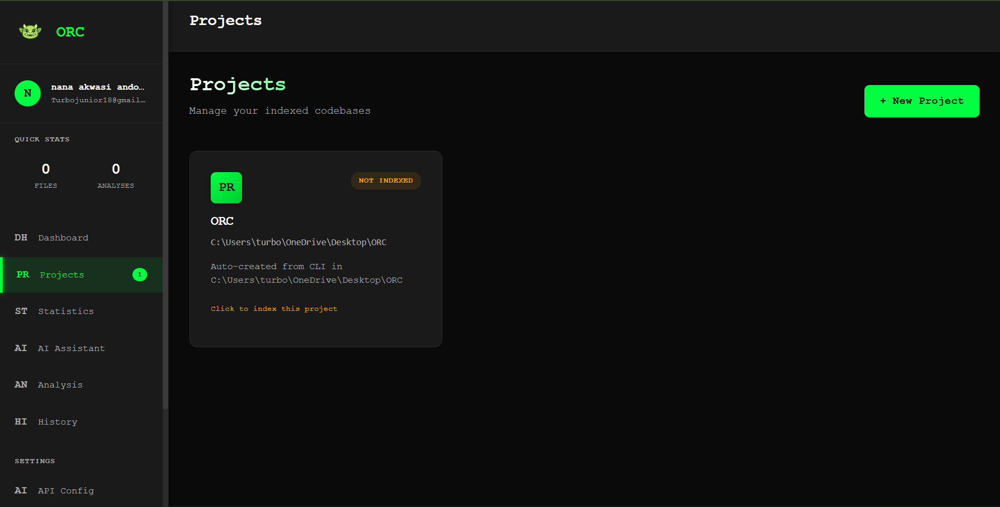

# ORC - Optimization & Refactoring Catalyst

<div align="center">


**Your AI-Powered Code Intelligence Assistant**

[](https://github.com/xytricit/orc/actions/workflows/ci.yml)
[](https://codecov.io/gh/xytricit/orc)
[](https://badge.fury.io/py/orc-cli)
[](https://www.python.org/downloads/)
[](LICENSE)
[](https://github.com/psf/black)
[](https://pepy.tech/project/orc-cli)

[Features](#-features) • [Installation](#-installation) • [Quick Start](#-quick-start) • [Documentation](#-documentation) • [Contributing](#-contributing)

</div>

---

## What is ORC?

ORC is an intelligent code analysis and refactoring assistant that combines powerful static analysis with AI to help you understand, optimize, and improve your codebase. Whether you're dealing with technical debt, trying to understand legacy code, or optimizing performance, ORC is your trusty companion.

### Why ORC?

- **AI-Powered Intelligence**: Chat with your codebase using natural language
- **Deep Analysis**: Find dead code, complexity hotspots, and performance issues
- **Beautiful Web Dashboard**: Visualize your code metrics and track improvements
- **Lightning Fast**: Efficiently indexes and analyzes large codebases
- **Modern UI**: Sleek black & green interface with real-time notifications
- **Privacy First**: All analysis runs locally, your code never leaves your machine

---

## 📸 Screenshots

### ORC Banner


### Web Dashboard


*Beautiful black & green interface with real-time stats and project management*

### CLI Commands


*Powerful command-line interface for code analysis and AI chat*

---

## Features

### AI-Powered Code Chat
```bash
orc
> "Show me the most complex functions"
> "Find unused code in the authentication module"
> "Explain what the UserService class does"
```

### Comprehensive Analysis
- **Dead Code Detection**: Find unused functions, classes, and imports
- **Complexity Analysis**: Identify functions that need refactoring
- **Dependency Mapping**: Visualize how your modules interact
- **Performance Hotspots**: Pinpoint optimization opportunities
- **Code Metrics**: Track LOC, cyclomatic complexity, and more

### Professional Web Interface
- **Interactive Dashboard**: Beautiful stats and visualizations
- **Project Management**: Handle multiple codebases effortlessly
- **AI Chat Interface**: Talk to your code through the web
- **Analysis History**: Track improvements over time
- **Smart Search**: Find documentation instantly with dropdown suggestions

### Developer-Friendly CLI
```bash
orc index              # Index your codebase
orc analyze            # Run full analysis
orc dead               # Find dead code
orc complexity         # Check complexity metrics
orc hotspots           # Find performance issues
```

---

## Installation

### Prerequisites
- Python 3.9 or higher
- pip package manager

### Install ORC
```bash
# Install the latest release
pip install orc-cli

# Verify installation
orc --version
```

### Upgrading
```bash
# Upgrade to the latest version
pip install --upgrade orc-cli
```

---

## Quick Start

### 1. Authenticate
```bash
orc login
```
This opens your browser to create an account and generate a CLI token.

### 2. Index Your Codebase
```bash
cd your-project
orc index
```

### 3. Start AI Chat
```bash
orc
```
Now chat with your codebase using natural language!

### 4. Access Web Dashboard
```bash
# Start the web server (runs automatically)
# Visit: http://127.0.0.1:5000
```

---

## Documentation

### User Guides
- [Getting Started](docs/getting_started.md) - First steps with ORC
- [CLI Reference](docs/cli/README.md) - Complete command documentation
- [Web Interface Guide](docs/web/README.md) - Using the dashboard
- [API Documentation](docs/api/README.md) - Integrate ORC into your tools

### Tutorials
- [Your First Analysis](docs/tutorials/first_analysis.md)
- [Using AI Chat](docs/tutorials/ai_chat.md)
- [Finding Dead Code](docs/tutorials/dead_code.md)
- [Performance Optimization](docs/tutorials/performance.md)

### Advanced Topics
- [Configuration](docs/configuration.md) - Customize ORC's behavior
- [Custom Parsers](docs/custom_parsers.md) - Add support for new languages
- [Deployment Guide](docs/DEPLOYMENT.md) - Production setup
- [Troubleshooting](docs/TROUBLESHOOTING.md) - Common issues and solutions

---

## Contributing

We love contributions! Whether it's bug fixes, new features, or documentation improvements, all help is appreciated.

### Getting Started
1. Fork the repository
2. Create a feature branch (`git checkout -b feature/amazing-feature`)
3. Make your changes
4. Run tests (`pytest`)
5. Commit your changes (`git commit -m 'Add amazing feature'`)
6. Push to the branch (`git push origin feature/amazing-feature`)
7. Open a Pull Request

See [CONTRIBUTING.md](CONTRIBUTING.md) for detailed guidelines.

---

## 📜 License

ORC is released under the [MIT License](LICENSE). Feel free to use it in your projects, both personal and commercial.

---

## Support & Community

- [Report a Bug](https://github.com/xytricit/orc/issues/new?template=bug_report.md)
- [Request a Feature](https://github.com/xytricit/orc/issues/new?template=feature_request.md)
- [Email Us](mailto:andohbempahnanaakwasi@gmail.com)

---

## 🌟 Star Us!

If you find ORC useful, please give us a star on GitHub!

[](https://github.com/xytricit/orc/stargazers)

---

<div align="center">

**Made with 💚 by developers, for developers**

</div>
